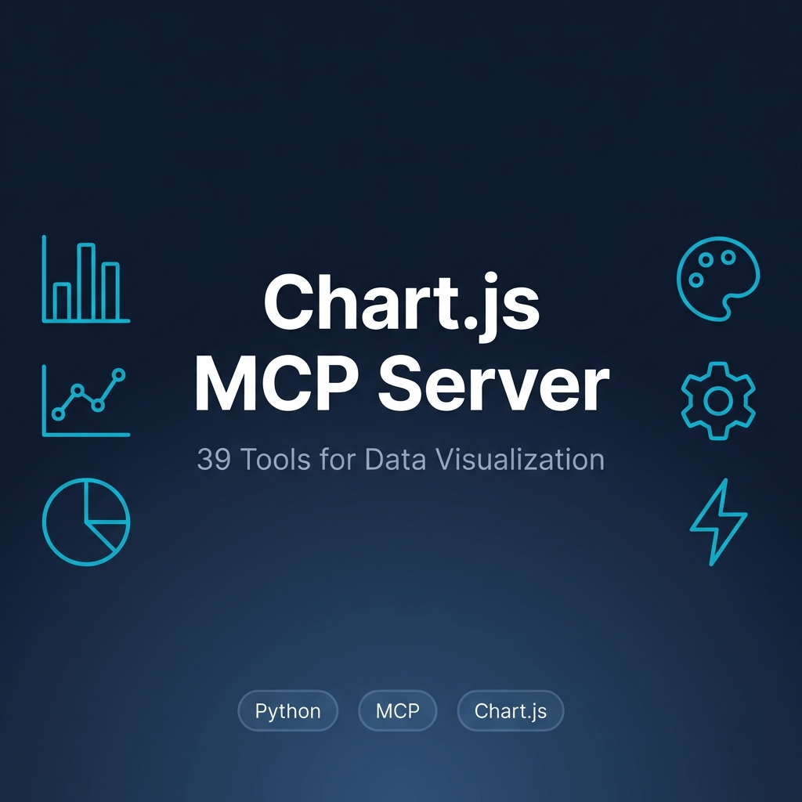

# Chart.js MCP Server



A comprehensive MCP (Model Context Protocol) server for generating Chart.js visualizations with 39 powerful tools. Create any type of chart with beautiful themes, advanced customization, data analysis, and export capabilities.

## 🎯 Features

- **15 Chart Types**: Bar, Line, Pie, Doughnut, Radar, Polar Area, Scatter, Bubble, Area, Funnel, Gauge, Waterfall, Heatmap, Candlestick, Time-Series
- **6 Beautiful Themes**: Dark, Light, Ocean, Sunset, Forest, Neon
- **4 Color Palettes**: Vibrant, Pastel, Professional, Earth
- **Data Analysis**: Statistical analysis, chart type suggestions, data transformations
- **Accessibility**: WCAG compliance, keyboard navigation, screen reader support
- **Responsive Design**: Mobile/tablet/desktop breakpoints
- **Interactive Features**: Zoom, pan, tooltips, animations
- **Export Options**: CSV export, image download
- **Real-time Support**: Streaming data configurations

## 📦 Installation

### Prerequisites

- Python 3.11 or higher
- [uv](https://github.com/astral-sh/uv) package manager

### Setup

1. Clone or download this repository:
```bash
cd /path/to/your/projects
git clone <your-repo-url> chartjs-mcp
cd chartjs-mcp
```

2. Install dependencies:
```bash
uv sync
```

## 🔧 Configuration

### For Claude Desktop

Add the following to your `claude_desktop_config.json`:

```json
{
  "mcpServers": {
    "chartjs": {
      "command": "uv",
      "args": [
        "--directory",
        "/Users/vaidaleelarajesh/chartjs-mcp",
        "run",
        "python",
        "server.py"
      ]
    }
  }
}
```

**Important**: Replace `/Users/vaidaleelarajesh/chartjs-mcp` with the actual absolute path to your installation directory.

### For Other MCP Clients

Use the same command structure:
- **Command**: `uv`
- **Args**: `["--directory", "/absolute/path/to/chartjs-mcp", "run", "python", "server.py"]`

## 🛠️ Available Tools (39 Total)

### Basic Chart Creation

1. **`create_chart_config`** - Generate any Chart.js configuration as JSON
2. **`create_chart_html`** - Generate complete HTML page with chart (supports themes)
3. **`get_chart_templates`** - Get example templates for common charts
4. **`get_color_palettes`** - View available color palettes

### Specialized Chart Types

5. **`create_pie_chart`** - Pie charts with color palettes
6. **`create_doughnut_chart`** - Doughnut charts with customizable cutout
7. **`create_bar_chart`** - Bar charts (vertical/horizontal, stacked)
8. **`create_line_chart`** - Line charts (smooth curves, filled areas)
9. **`create_radar_chart`** - Radar/spider charts for multi-dimensional data
10. **`create_polar_area_chart`** - Polar area charts
11. **`create_scatter_chart`** - Scatter plots for correlation analysis
12. **`create_bubble_chart`** - Bubble charts with 3D data (x, y, radius)
13. **`create_mixed_chart`** - Combine multiple chart types
14. **`create_area_chart`** - Filled line charts (stacked areas)
15. **`create_time_series_chart`** - Time-based charts with date/time axis
16. **`create_funnel_chart`** - Conversion funnel visualization
17. **`create_gauge_chart`** - Gauge/speedometer charts with thresholds
18. **`create_waterfall_chart`** - Financial waterfall charts
19. **`create_heatmap_chart`** - Matrix-based heatmaps
20. **`create_candlestick_chart`** - OHLC charts for financial data
21. **`create_realtime_chart_config`** - Optimized for live data streaming

### Data Analysis & Transformation

22. **`analyze_data_for_chart`** - Analyze data and suggest best chart type with statistics
23. **`transform_data_cumulative`** - Convert data to cumulative sums
24. **`transform_data_moving_average`** - Calculate moving averages
25. **`transform_data_percentage_change`** - Calculate percentage changes
26. **`filter_chart_data`** - Filter data by conditions (greater_than, less_than, etc.)

### Advanced Customization

27. **`add_chart_animations`** - Add smooth animations to charts
28. **`create_comparison_chart`** - Side-by-side comparison of two datasets
29. **`create_multi_axis_chart`** - Multiple y-axes for different scales
30. **`create_chart_with_annotations`** - Add lines, boxes, and labels
31. **`merge_chart_datasets`** - Combine datasets from multiple charts
32. **`create_theme_preset`** - Get complete theme configurations
33. **`create_gradient_dataset`** - Create datasets with gradient colors
34. **`add_statistical_overlay`** - Add mean/median lines to charts

### Interactive Features

35. **`add_interactive_tooltips`** - Advanced tooltip customization
36. **`add_zoom_pan_controls`** - Interactive zoom and pan functionality

### Accessibility & Responsive Design

37. **`add_responsive_breakpoints`** - Mobile/tablet/desktop configurations
38. **`add_accessibility_features`** - WCAG compliance features

### Export & Utilities

39. **`export_chart_data_csv`** - Export chart data as CSV
40. **`export_chart_as_image_html`** - Generate HTML for image export

## 💡 Usage Examples

### Example 1: Simple Bar Chart

```
Create a bar chart showing monthly sales:
- January: 1200
- February: 1900
- March: 800
- April: 1500
```

### Example 2: Pie Chart with Theme

```
Create a pie chart showing browser market share with the ocean theme:
- Chrome: 65%
- Firefox: 15%
- Safari: 10%
- Edge: 7%
- Other: 3%
```

### Example 3: Time Series Chart

```
Create a time series line chart showing stock prices over the last week with dates on the x-axis.
```

### Example 4: Data Analysis

```
Analyze this data and suggest the best chart type: [12, 45, 23, 67, 89, 34, 56, 78, 90, 23]
```

### Example 5: Comparison Chart

```
Create a comparison chart showing Q1 vs Q2 sales across different products.
```

### Example 6: Export to HTML

```
Generate a complete HTML page with a doughnut chart showing project completion status, using the dark theme.
```

### Example 7: Advanced Features

```
Create a line chart with moving average overlay and zoom/pan controls enabled.
```

## 🎨 Available Themes

- **Dark**: Modern dark theme with vibrant colors
- **Light**: Clean light theme with professional colors
- **Ocean**: Deep blue oceanic theme
- **Sunset**: Warm sunset colors
- **Forest**: Natural green forest theme
- **Neon**: High-contrast neon theme

## 🎨 Color Palettes

- **Vibrant**: Bold, eye-catching colors
- **Pastel**: Soft, gentle colors
- **Professional**: Business-appropriate colors
- **Earth**: Natural, earthy tones

## 📊 Chart Types Reference

| Chart Type | Best For | Example Use Case |
|------------|----------|------------------|
| Bar | Comparing categories | Sales by region |
| Line | Trends over time | Stock prices |
| Pie | Proportions/percentages | Market share |
| Doughnut | Proportions with center space | Budget allocation |
| Radar | Multi-dimensional comparison | Product features |
| Polar Area | Cyclical data | Seasonal trends |
| Scatter | Correlation analysis | Height vs weight |
| Bubble | 3D relationships | Sales vs profit vs market size |
| Area | Cumulative trends | Revenue growth |
| Funnel | Conversion processes | Sales funnel |
| Gauge | Single metric progress | Goal completion |
| Waterfall | Sequential changes | Financial breakdown |
| Heatmap | Matrix correlations | User activity patterns |
| Candlestick | Financial OHLC data | Stock trading |
| Time Series | Time-based trends | Website traffic |

## 🔍 Data Analysis Features

The `analyze_data_for_chart` tool provides:
- **Statistics**: Count, sum, mean, median, min, max, range, standard deviation, variance
- **Chart Suggestions**: Automatic recommendations based on data characteristics
- **Data Summary**: Overview of your dataset

## ♿ Accessibility Features

- Keyboard navigation support
- Screen reader announcements
- ARIA labels and descriptions
- WCAG 2.1 compliance

## 📱 Responsive Design

Automatic breakpoints for:
- **Mobile** (< 480px): Bottom legend, smaller fonts
- **Tablet** (481-768px): Top legend, medium fonts
- **Desktop** (> 768px): Right legend, larger fonts

## 🚀 Advanced Features

### Real-time Data Streaming
Configure charts optimized for live data updates with automatic point limiting.

### Interactive Controls
- **Zoom**: Mouse wheel or pinch gestures
- **Pan**: Click and drag
- **Tooltips**: Hover for detailed information

### Statistical Overlays
Add mean, median, and standard deviation lines to any chart.

### Data Transformations
- Cumulative sums
- Moving averages
- Percentage changes
- Custom filtering

## 🧪 Testing

Test the server locally:

```bash
uv run python test_client.py
```

Or use the MCP inspector:

```bash
uv run mcp dev server.py
```

## 📝 Development

The server is built using:
- **FastMCP**: Modern MCP server framework
- **Python 3.11+**: Latest Python features
- **Chart.js**: Popular JavaScript charting library

## 🤝 Contributing

Contributions are welcome! Feel free to:
- Add new chart types
- Improve existing tools
- Add more themes and color palettes
- Enhance documentation

## 📄 License

MIT License - feel free to use in your projects!

## 🆘 Support

If you encounter issues:
1. Check that the path in your MCP config is correct
2. Ensure Python 3.11+ is installed
3. Verify `uv` is installed and accessible
4. Check the MCP server logs for errors

## 🎓 Learn More

- [Chart.js Documentation](https://www.chartjs.org/docs/)
- [MCP Protocol](https://modelcontextprotocol.io/)
- [FastMCP Framework](https://github.com/jlowin/fastmcp)

---

**Made with ❤️ for data visualization enthusiasts**
